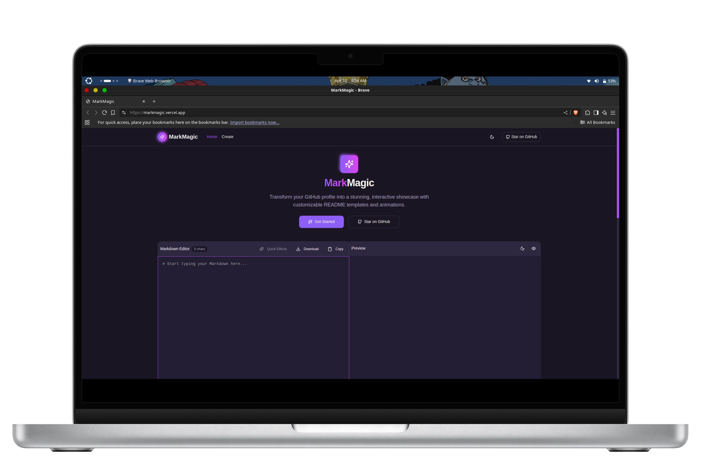
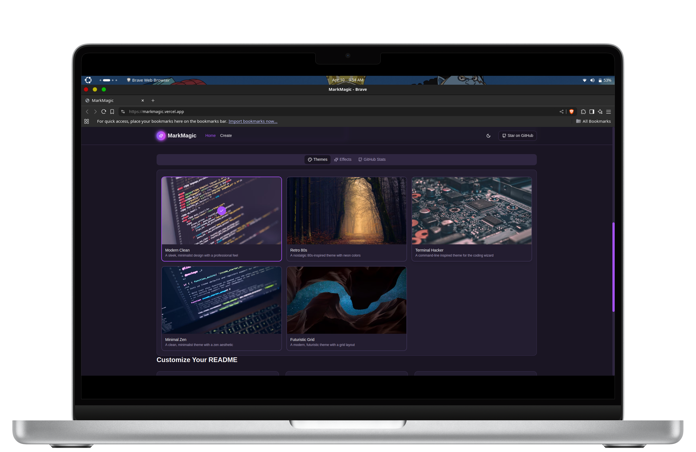
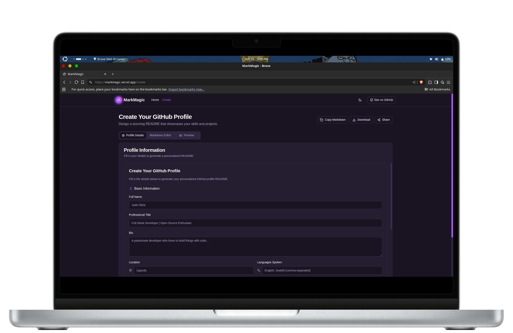

<div align="center">
  
  
  <p align="center">
    <a href="https://github.com/judeotine/MarkMagic/stargazers">
      
    </a>
    <a href="https://github.com/judeotine/MarkMagic/network/members/">
      
    </a>
    <a href="https://github.com/judeotine/MarkMagic/issues">
      
    </a>
    <a href="https://github.com/judeotine/MarkMagic/blob/main/LICENSE">
      
    </a>
  </p>

  <p>
    
  </p>
</div>

<br />

## 🖥️ Screen Previews

<div align="center">
  <h3>✨ Modern Dashboard Interface</h3>
  
  
  <div style="display: flex; justify-content: space-between; margin: 40px 0; gap: 30px;">
    <div style="flex: 1;">
      <h3>🎨 Theme Customization</h3>
      
    </div>
    <div style="flex: 1;">
      <h3>🛠️ Component Library</h3>
      
    </div>
  </div>
</div>

## ✨ Key Features

<div style="display: grid; grid-template-columns: repeat(auto-fit, minmax(300px, 1fr)); gap: 20px; margin: 30px 0;">
  <div style="background: #f8f9fa; padding: 20px; border-radius: 10px;">
    <h3>🎨 Drag-and-Drop Builder</h3>
    <ul>
      <li>Pre-designed templates (Neon, Minimalist, Hacker)</li>
      <li>Modular components that snap into place</li>
      <li>Real-time preview as you build</li>
    </ul>
  </div>
  
  <div style="background: #f8f9fa; padding: 20px; border-radius: 10px;">
    <h3>🌀 Built-in Animations</h3>
    <ul>
      <li>Floating emojis and typing effects</li>
      <li>Animated SVGs and CSS-powered gradients</li>
      <li>Interactive hover effects</li>
    </ul>
  </div>
  
  <div style="background: #f8f9fa; padding: 20px; border-radius: 10px;">
    <h3>🤖 AI-Powered Magic</h3>
    <ul>
      <li>README Wizard generates draft from questions</li>
      <li>Auto-suggests badges and integrations</li>
      <li>Content optimization suggestions</li>
    </ul>
  </div>
</div>

## 🛠️ Tech Stack

<div align="center">
  <table>
    <tr>
      <td align="center" width="96">
        
        <br>React
      </td>
      <td align="center" width="96">
        
        <br>TypeScript
      </td>
      <td align="center" width="96">
        
        <br>Tailwind
      </td>
      <td align="center" width="96">
        
        <br>Vite
      </td>
      <td align="center" width="96">
        
        <br>GitHub
      </td>
    </tr>
  </table>
</div>

## 🚀 Quick Start

1. **Visit the app**: [https://markmagic.vercel.app/](https://markmagic.vercel.app/)
2. **Choose a template**: Pick from several pre-designed themes
3. **Customize content**: Fill in your details or use our AI assistant
4. **Add animations**: Choose from various animated elements
5. **Preview your README**: See how it will look on GitHub
6. **Export & use**: Copy the markdown or download as a file

```bash
# For local development:
git clone https://github.com/judeotine/MarkMagic.git
cd MarkMagic
npm install
npm run dev
```

## 💡 Creative Profile Ideas

<div style="background: #f5f3ff; padding: 20px; border-radius: 10px; border-left: 4px solid #8b5cf6; margin: 20px 0;">
  <h3>🎨 Make Your Profile Stand Out</h3>
  <ul>
    <li><strong>Live coding stats</strong> with WakaTime integration ⌨️</li>
    <li><strong>Interactive portfolio</strong> with project showcases 🖼️</li>
    <li><strong>Daily dev meme</strong> refreshed via GitHub Actions 😂</li>
    <li><strong>Fake terminal</strong> that responds to commands 💻</li>
  </ul>
</div>

## 🤝 Contributing

We welcome contributions from the community! Here's how you can help:

1. Fork the repository
2. Create a new branch (`git checkout -b feature/your-feature`)
3. Commit your changes (`git commit -m 'Add some feature'`)
4. Push to the branch (`git push origin feature/your-feature`)
5. Open a Pull Request

Please make sure to update tests as appropriate and follow our code style guidelines.

## 📜 License

This project is licensed under the MIT License - see the [LICENSE](LICENSE) file for details.

## 💖 Support the Project

If you find MarkMagic useful, please consider:

<div align="center" style="margin: 20px 0;">
  <a href="https://github.com/judeotine/MarkMagic/stargazers">
    
  </a>
  <a href="https://github.com/judeotine/MarkMagic/issues">
    
  </a>
</div>

## ✨ Meet the Creator

<div align="center">
  <p>Developed with by <a href="https://judeotine.vercel.app/">Jude Otine</a></p>
  <div>
    <a href="https://github.com/judeotine">
      
    </a>
    <a href="https://twitter.com/judeotine">
      
    </a>
  </div>
</div>

<div align="center">
  
</div>
